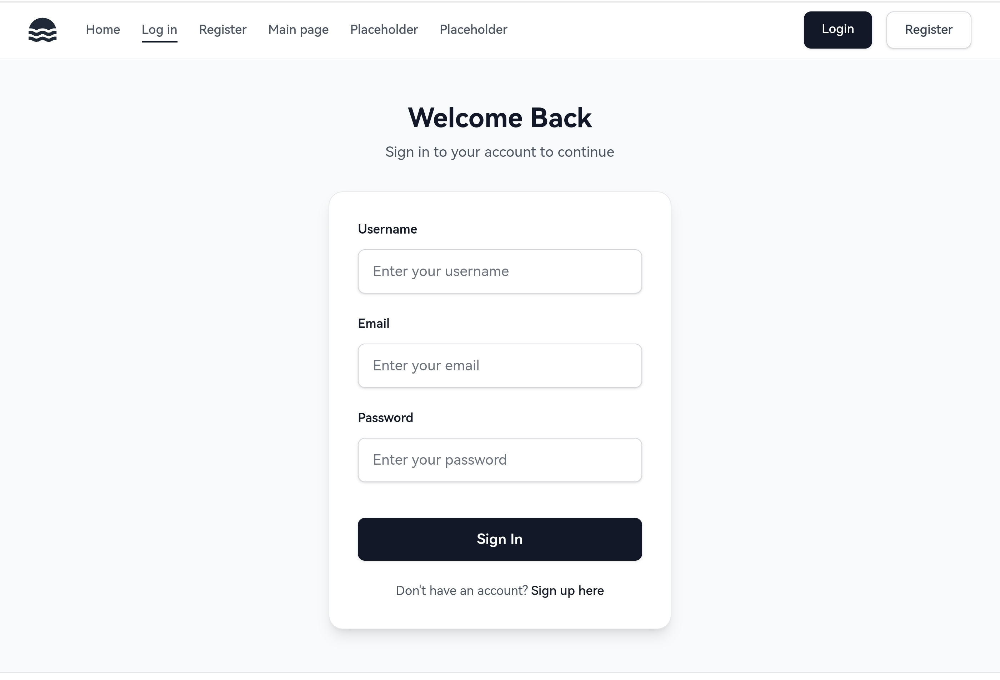
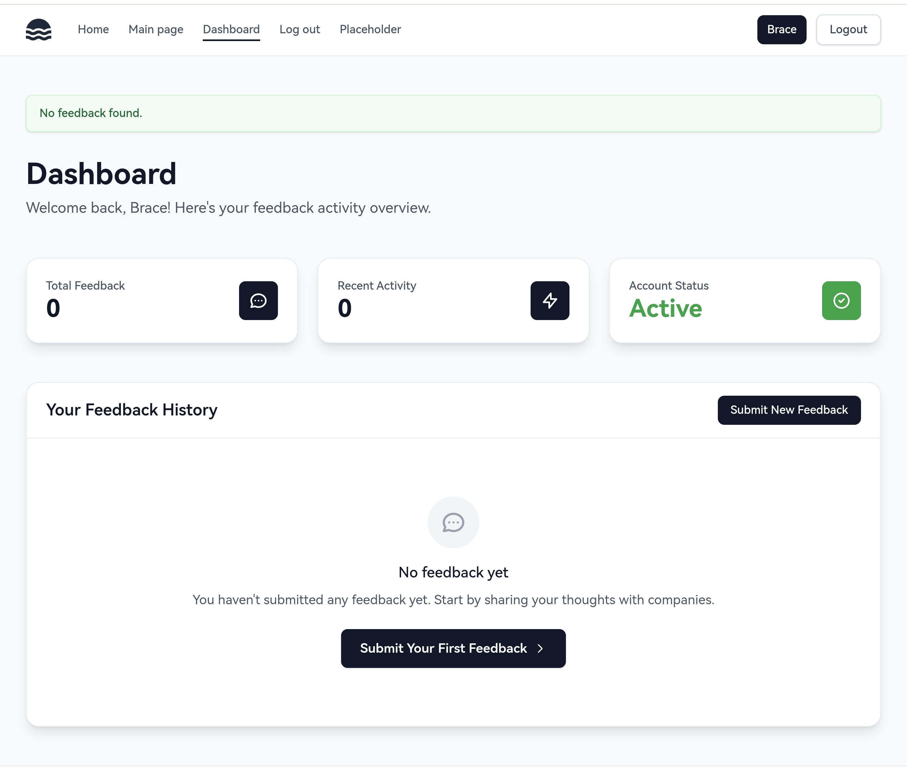
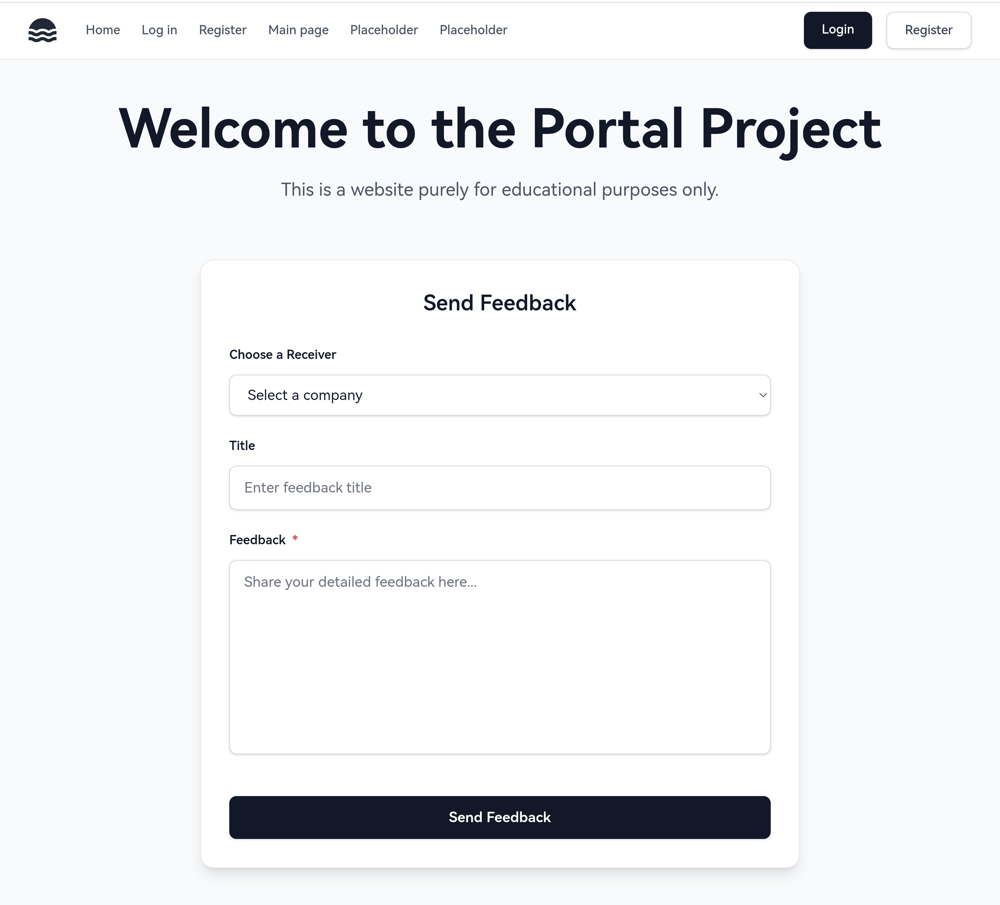
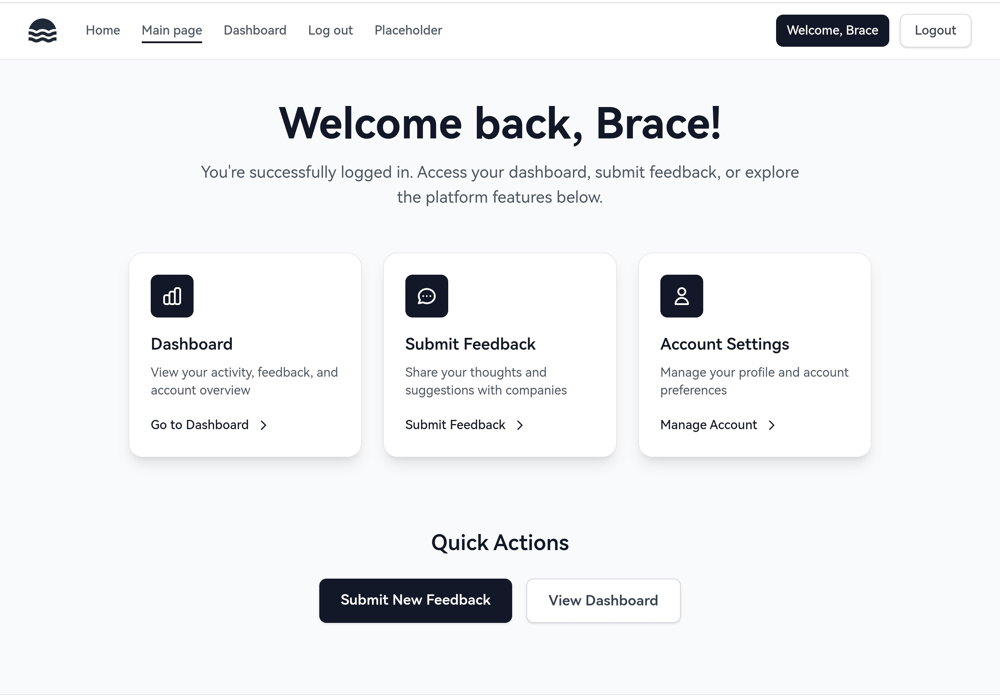

# Portal - Customer Feedback Management System

A lightweight feedback management system that replaces scattered email threads with an organized dashboard. Built with Flask and SQLite, featuring user authentication, and public submission forms.

**Why not just use email?** Email is fine for one-off messages, but when managing product feedback from multiple customers, you need organization, status tracking, and trend analysis - that's where Portal comes in.

**Full transparency:** This current implementation is fairly basic - it's missing features like advanced analytics, and email notifications. But the core idea is here: a centralized system for managing feedback that's more organized than email threads.

## Features

### For Companies
- 🔐 Secure registration and authentication with password hashing
- 📊 Feedback dashboard with filtering and search
- 📈 Analytics view showing trends and categories
- ✅ Status management (New, In Progress, Resolved)
- 🔗 Unique public submission links for each company

### For Customers
- 📝 Simple public feedback submission form
- 🏷️ Category selection (Bug Report, Feature Request, General Feedback)
- ✉️ Optional email for follow-up
- 🎯 No login required

Think of it as a lightweight alternative to tools like Canny or UserVoice for small teams who don't need (or can't afford) enterprise feedback software.

## Tech Stack

- **Backend:** Python Flask
- **Database:** SQLite (development)
- **Frontend:** HTML, CSS, TailwindCSS

## Installation & Setup

### Prerequisites
- Python 3.8+
- pip package manager and venv

### Local Development

1. Clone the repository:
```bash
git clone https://github.com/Be1l-ai/Portal_Project.git
cd Portal_Project
```

2. Create virtual environment:
```bash
python -m venv venv
source venv/bin/activate
```

3. Install dependencies:
```bash
pip install -r requirements.txt
```

4. Initialize the database:
```bash
flask --app myapp init-db
```

5. Run the application:
```bash
python main.py
```

6. Open `http://localhost:5000` in your browser

## Project Structure

```
Portal_Project/
├── myapp/
│   ├── __init__.py           # App factory
│   ├── utils.py
│   ├── db.py                 # Database utilities
│   ├── auth/               # Authentication routes
│   ├── main/               # Main routes
│   ├── feedback/           # Feedback routes
│   ├── templates/            # HTML templates
│   │   ├── base.html
│   │   ├── auth/
│   │   │   ├── login.html
│   │   │   └── register.html
│   │   ├── index.html
│   │   └── main/
│   └── static/               # CSS, JS, images
├── requirements.txt
├── README.md
└── .gitignore
```

## Screenshots

### Login Page


### Dashboard


### Feedback Submission Form


### Main View


## What I Learned

Building this project taught me:
- **User authentication:** Password hashing with Werkzeug, session management
- **Database design:** Relationships (one-to-many), foreign keys
- **Form validation:** Server-side validation, error handling
- **Blueprint structure:** Organizing Flask apps with blueprints
- **Flask framework:** Flask basics implementation and usage
- **Public vs authenticated routes:** Managing access control
- **CRUD operations:** Create, Read, Update, Delete feedback

## Limitations

- SQLite for development (not suitable for high-traffic production)
- No email notifications for new feedback
- No file attachments for feedback submissions
- No team member roles (admin, viewer)
- Manual database setup

## Future Improvements

- [ ] Email notifications when feedback is submitted/resolved
- [ ] Export feedback to CSV/PDF
- [ ] File attachment support
- [ ] Team member roles and permissions
- [ ] Migrate to PostgreSQL for production
- [ ] API endpoints for integrations
- [ ] Search functionality for feedback
- [ ] Bulk status updates

## Development Notes

This project was built as a small quick project to demonstrate full-stack web development skills with Flask and SQLite. The focus was on:
- Proper authentication implementation
- Clean code organization with blueprints
- Database relationships and CRUD operations
- Form validation and error handling

**Built with Flask to demonstrate full-stack web development, authentication, and database management.**